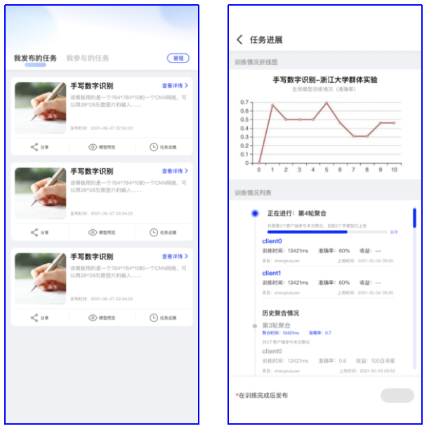
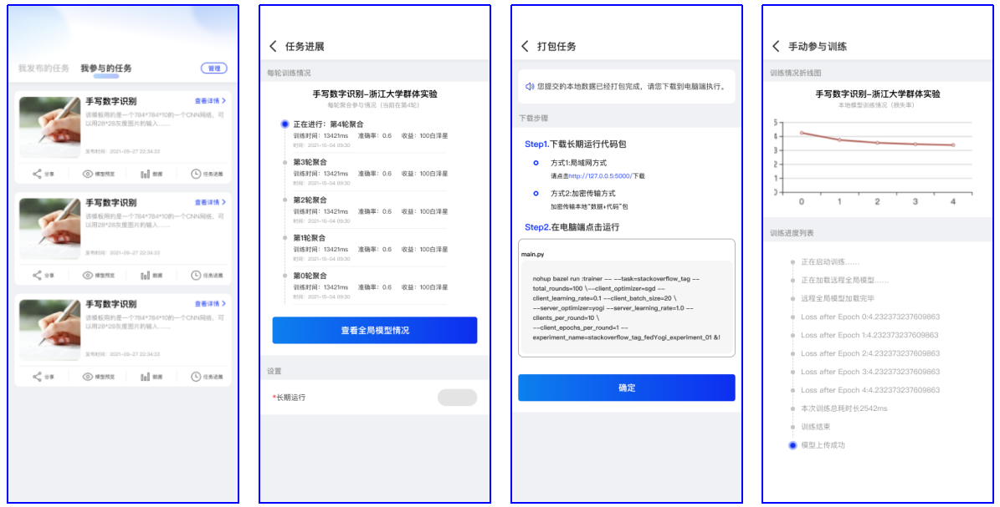

白泽问卷README
===
# baize

> 白泽问卷,预见未来!!!
# 1.项目概述
## 1.1 项目名称
- 本参赛作品名称为白泽问卷，是一款基于FATE平台的模型聚合与数据定价应用。“白泽”也是我们团队的队名，他是黄帝在泰山收的神兽，他上知天文，下知地理，能够预知未来，还能说话，是一种祥瑞的神兽，它就是祥瑞的象征，因此队名和作品名取“白泽”，寓意我们团队希望能够开启一扇联邦学习应用时代的大门，我们的作品能够解决联邦学习现存痛点，并且成为联邦学习界的工具类应用。

- 上图是我们项目Logo，其中白色鹿形表示我们这次项目的吉祥物白泽；主体上是一个蓝色的盾牌，表示白泽问卷是一款尊重数据隐私的、充分运用联邦学习、区块链、安全多方计算等数据隐私计算技术的软件；主体盾牌也可以看做一张纸质的问卷，其右上角被掀开，露出一个金黄色的小圆点，表示白泽问卷的特色功能，即白泽问卷通过问卷的形式来实现用户数据的收益和公平分配。
## 1.2 产品说明
- 白泽问卷是集数据收集、模型训练与聚合、数据定价于一体的联邦学习应用，包括小程序和Web端两部分。小程序端主要是以问卷形式向海量C端用户收集模型训练过程中所需的数据，通过在用户本地生成子模型的方式来保护数据隐私（通过加密传输的方式来保护数据隐私），小程序的特点是轻量级，可以方便地进行问卷的发布与填写。Web端主要是通过FATE平台来聚合模型，并根据数据贡献来进行数据定价，在此过程中生成有价值的模型和可以交易的数据。因此，本产品一方面解决了模型训练数据短缺的痛点，另一方面使数据贡献者得到应有的收益，促进数据的充分利用与流通，最重要的是让人工智能与公众不再那么遥不可及，让用户在白泽问卷中触碰最新深度学习、联邦学习等技术，解决现实难题。

## 2.1 技术性
1. 通过采用Shapley等数据定价方法。本产品实现了公平分配问卷收益，使得数据的提供者能根据数据质量的不同、数据量的不同来收获不同的收益。
2. 通过区块链保障了系统的安全性。本产品通过引入区块链，进一步地保障了联邦学习过程的安全性。
   ①避免用户的数据遭受攻击；
   ②保证了数据定价过程的公开透明、可追溯、防篡改。
3. 使用了computer vision以及nature language process中最新的sota算法，为联邦学习助力。在算法领域准备使用Swin transformer、Bert等网络结构助力分类、分割网络。

# 3. 项目使用
## 3.1 发布问卷

用户从首页点击「发布问卷」，选择「联邦学习问卷」，此时可以选择「从模板创建」和「自定义创建」。

「从模板创建」：进入模板分类列表，选择要使用的模板，模板上会展示任务简介、参数、数据格式等，点击「使用此模板」，进入模板编辑界面，可以设置最大参与次数、每份数据奖励等，点击「预览」，可以看到发布后的问卷样式，点击「发布」，即可讲问卷分享给问卷填写者。

## 3.2 模型训练可视化
用户可以在小程序中查看任务的训练进展，分为「我发布的任务」和「我参与的任务」。包括任务信息等。
「我发布的任务」：点击「任务进展」可以查看当前聚合进展和历史聚合情况以及模型准确率变化。

「我参与的任务」：点击「任务进展」可以查看我在每轮聚合中的参与情况，点击「长期运行」可以将任务打包后在电脑端执行；点击「数据」可以查看或添加本地数据，还可以点击「手动参与训练」来生成并上传本地模型。

## 3.3 有价值的模型展示
首页会为用户推荐最热门的模型，用户点击模型可以进入模型体验界面，当前可以体验的模型包括抑郁症检测，水果新鲜度检测，未来宝宝长相预测等。

